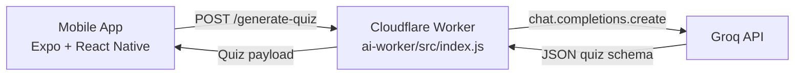

<p align="center">
  
</p>

<h1 align="center">Quizly</h1>

<p align="center">
  <strong>AI-powered quiz generation app</strong><br/>
  React Native (Expo) frontend + Cloudflare Worker backend powered by Groq.
</p>

<p align="center">
  <a href="#demo">Demo</a> •
  <a href="#architecture">Architecture</a> •
  <a href="#quick-start">Quick Start</a> •
  <a href="#api-contract">API Contract</a>
</p>

## Demo

<video src="./my-app/assets/demo.mp4" controls width="100%">
  Your browser does not support the video tag.
</video>

## Overview

Quizly lets users enter any topic and instantly get multiple-choice questions generated by AI.

- Frontend: Expo + React Native app in `my-app`
- Backend: Cloudflare Worker in `ai-worker`
- AI provider: Groq via `groq-sdk`
- Data flow: App sends topic -> Worker builds structured prompt -> AI returns strict JSON quiz

## Architecture



## Repository Structure

```text
Quizly/
├─ ai-worker/                 # Backend: Cloudflare Worker + AI generation
│  ├─ src/index.js            # Main API endpoint (/generate-quiz)
│  ├─ test/index.spec.js      # Vitest tests (currently starter template)
│  ├─ wrangler.jsonc          # Worker config
│  └─ package.json
├─ my-app/                    # Frontend: Expo app (expo-router)
│  ├─ app/index.jsx           # Topic input screen
│  ├─ app/quiz.jsx            # Quiz gameplay screen
│  ├─ hooks/useQuestions.jsx  # API integration hook
│  ├─ assets/                 # Images + your logo/demo assets
│  └─ package.json
└─ README.md                  # You are here
```

## Tech Stack

### Frontend (`my-app`)

- Expo SDK 54
- React Native 0.81
- Expo Router
- Axios for API requests

### Backend (`ai-worker`)

- Cloudflare Workers
- Wrangler CLI
- Groq SDK (`groq-sdk`)
- Vitest + Cloudflare test pool

## Quick Start

### 1. Prerequisites

- Node.js 18+
- npm
- Cloudflare account + Wrangler login (for backend deploy/dev with secrets)

### 2. Install dependencies

From repo root, run:

```bash
cd ai-worker
npm install

cd ../my-app
npm install
```

### 3. Configure backend secret

From `ai-worker`:

```bash
npx wrangler secret put GROQ_API_KEY
```

Paste your Groq API key when prompted.

### 4. Run backend (local worker)

```bash
cd ai-worker
npm run dev
```

This starts the Worker with Wrangler.

### 5. Run frontend (Expo app)

In a second terminal:

```bash
cd my-app
npm run start
```

Then open in Expo Go, Android emulator, iOS simulator, or web.

## API Contract

Backend endpoint:

- Method: `POST`
- Path: `/generate-quiz`
- Base URL (deployed): `https://quizly-ai-worker.defund-ai.workers.dev`

### Request Body

```json
{
  "topic": "The Solar System",
  "difficulty": "easy",
  "numQuestions": 5
}
```

### Response Body

```json
{
  "topic": "The Solar System",
  "difficulty": "easy",
  "totalQuestions": 5,
  "questions": [
    {
      "question": "What is the largest planet in our solar system?",
      "options": ["Earth", "Mars", "Jupiter", "Saturn"],
      "answer": "Jupiter"
    }
  ]
}
```

### Error Responses

- `400` for invalid JSON or missing `topic`
- `404` for unknown route
- `405` for non-POST method
- `500` for missing `GROQ_API_KEY` or AI generation failure

## Frontend Flow

1. User enters a topic on `app/index.jsx`.
2. App navigates to `app/quiz.jsx` with topic query param.
3. `hooks/useQuestions.jsx` calls the Worker endpoint.
4. Quiz screen renders one question at a time with answer feedback and final score.

## Deployment

### Deploy Worker

```bash
cd ai-worker
npm run deploy
```

### Build/Run App

Use Expo workflows from `my-app`:

```bash
npm run android
npm run ios
npm run web
```

## Known Gaps (Current State)

These are worth addressing in future iterations:

- `ai-worker/test/index.spec.js` still contains starter "Hello World" tests and does not match current Worker behavior.
- `my-app/hooks/useQuestions.jsx` sends `totalQuestions` while backend expects `numQuestions`.
- `my-app/hooks/useQuestions.jsx` hardcodes the deployed Worker URL; local/dev environment switching can be improved.
- Minor naming typo in state (`quizes` vs `quizzes`) and related shape checks can be cleaned up for clarity.

## Assets You Planned to Add

Place these files here:

- Logo: `my-app/assets/logo.png`
- Demo video: `my-app/assets/demo.mp4`

The README is already set up to display both.

## Scripts Reference

### Backend (`ai-worker/package.json`)

- `npm run dev` -> run Worker locally with Wrangler
- `npm run deploy` -> deploy Worker
- `npm run test` -> run Vitest

### Frontend (`my-app/package.json`)

- `npm run start` -> Expo dev server
- `npm run android` -> open Android flow
- `npm run ios` -> open iOS flow
- `npm run web` -> open web target
- `npm run lint` -> lint app

## License

Add your preferred license here (MIT, Apache-2.0, etc.).
